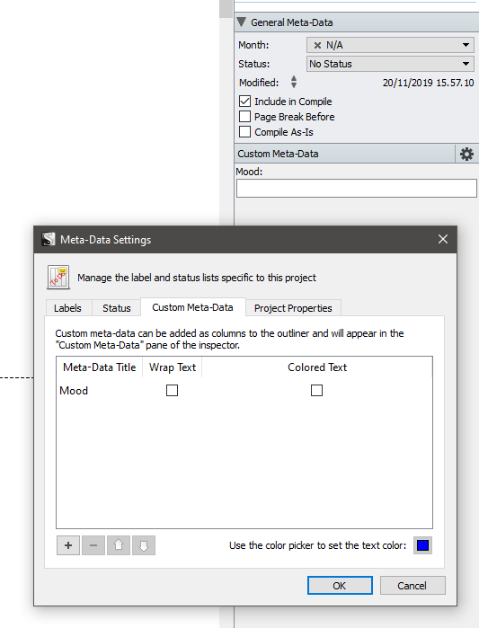
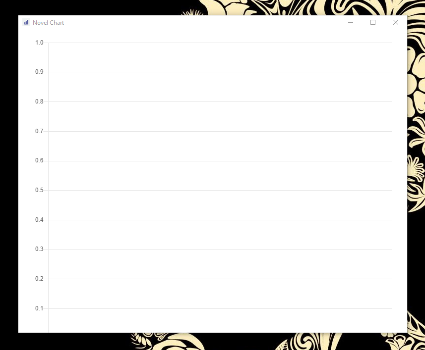
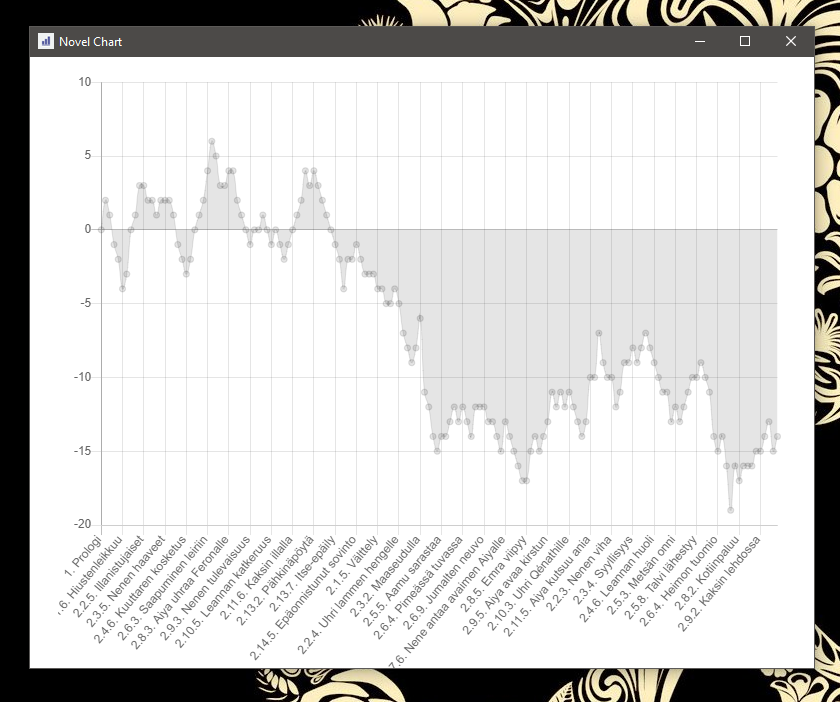

# Novel Chart
This is a lightweight desktop app that allows you to visualize novels as emotional arcs, inspired by [the Hedonometer](http://hedonometer.org/about.html).

## Installation
Download the latest release from the [installs folder](installs).

Run the exe and wait for the installer to finish. 

Your exe should open when the installation is complete.

## Usage
You need an .txt file containing your novel's outline. This can be generated by Scrivener or written by hand. Currently NovelChart supports a very limited notation but may see improvements in the future.

### Outline notation
There's an example of a simple outline [here](docs/outline.txt).

```
1. Chapter One
Mood:	0
  
2. Chapter Two
Mood:	1
  
3. Chapter Three
Mood:	3
```

Any line starting with a number and a dot (e.g. `2.`) will be used as a scene label. 

There may be other lines in the outline following the label: NovelChart will skip those and attach the next Mood value found to the label. 

**Use a tab instead of spaces to mark the Mood value** or the parser won't read them correctly. You can copy the example above to use it as a template. 

If you're using Scrivener, see the guide below.

### Best Practices
Mood values are tracked relative to the current scene/chapter and signify a *turn of events for better or worse* for the characters. A neutral scene would be marked with `0`, while a highly exciting/scary/tense scene could be signified with `-3` (your notation will wary depending on what you want to track). 

Try to be consistent in your notation. Scenes with similar turns of events should use the same Mood value. If scenes are split into multiple documents (like in Scrivener), split the values into both of those scenes (`1` + `2` = `3`) or mark one of them as neutral (`0`).

Values between `-3` and `3` are enough for most stories, with most scenes falling well within those extremes. Special scenes, like a character death, may warrant the use of lower values (e.g. `5`). These should display as a massive dip in the chart, making them more easily trackable.

Transitional scenes are exposition should generally be marked as neutral (`0`). Similarly scenes following an especially tense scene that may still carry some of that tension should be counted as neutral until there's a new turn in tension. 

**Beware of marking the same tension twice** in consecutive scenes, as this will throw off your visualizations. 

### Scrivener
Edit Scrivener's Meta-Data Settings to add a field called Mood. The Custom Meta-Data tag in your inspector below the synopsis.



**Only add Mood values to one level of files**. In other words if you keep scenes in a chapter folder and you want to track Mood values for scenes, don't add a total Mood value to the chapter. NovelChart will sum those values together and produce faulty results if the Mood value exists in duplicates.

#### Compiling your outline
Scrivener's Compile feature allows you to quickly produce NovelChart outlines. 

First, download the [preconfigured compilation settings here](docs/NovelChartCompile.ini) to get you started. Then go to `File -> Compile... -> Load Preset -> Import..` to load NovelChartCompile.ini into Scrivener.

Edit the formatting settings if the predefined formatting excludes your scene/chapter headings. *Make sure Scrivener automatically numbers the scene/chapter titles your Mood values are attached to*. 

Compile the project to make a txt file of your outline.

**If you had to edit the default formatting**, remember to save your custom compilation settings for later use.

### Rendering the Mood chart
Click the empty chart to import your outline.



A file browser should open. Navigate to your .txt file and open it.

Your mood chart should now render like this:



#### Frequently Asked Questions
**My chart remains empty, what do I do?** The current version of NovelChart may not alert when failing to render malformed outlines. Check your formatting and try again if the chart stays empty.

**How do I open another outline?** Click on the chart again to open another file. The chart will re-render with the new data.

**My chart doesn't fit the window.** Sometimes the renderer fails to match the chart to the size of the window. You can resize the window from the bottom corner to make your chart fully visible. 

# Developers
This app was built using Electron: https://www.electronforge.io/

### Quickstart
1. Download the repository
2. Run `npm install` to download dependencies
3. Run `npm start` to start the app in developer mode
4. Package the app by running `npm run package`
5. Build an installer by running `npm run make`
6. Run `npm run publish` to copy the installer into the installs folder